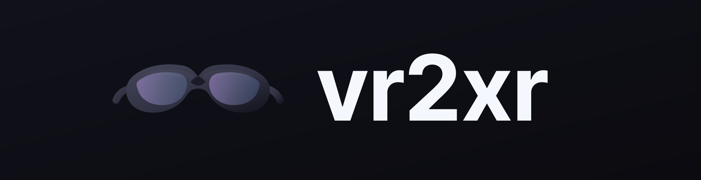
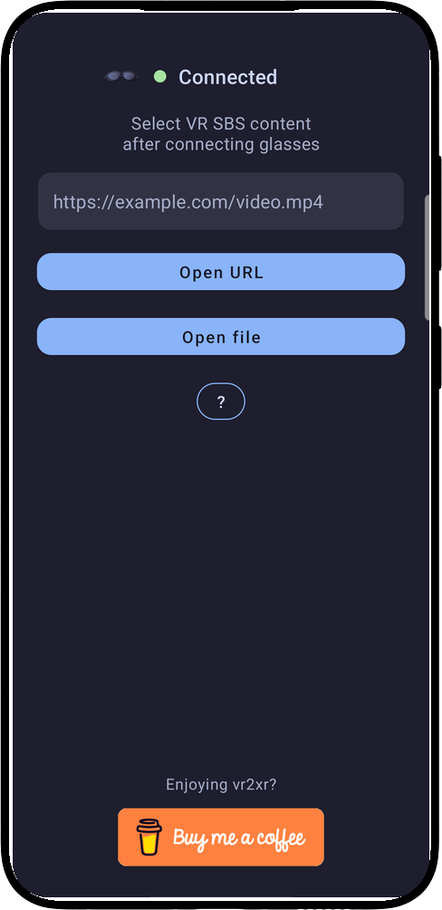
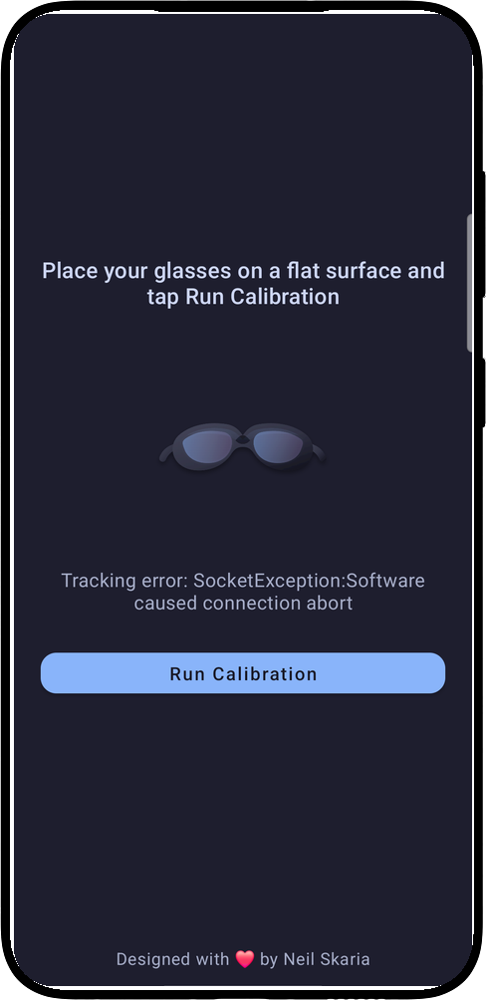
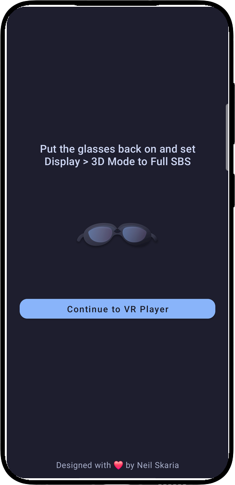
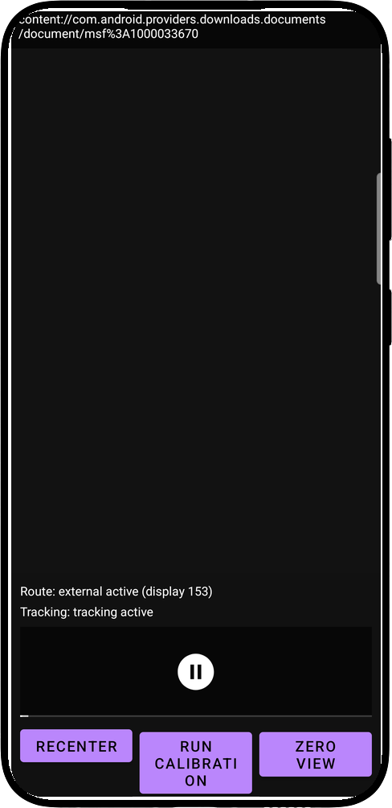
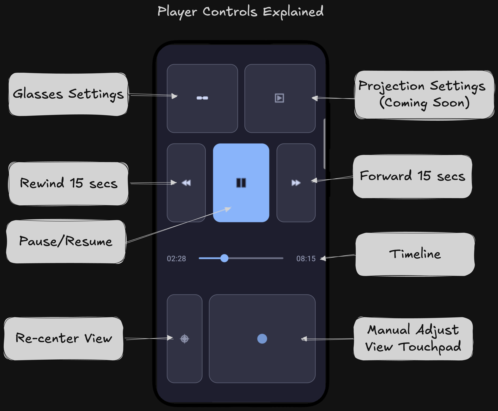

  

  

**vr2xr is an Android app for watching VR SBS video on XREAL One glasses. It supports VR180 SBS content and focuses on simple, reliable playback with phone-based controls and IMU head tracking.**

---

  
  &nbsp;
  
  &nbsp;
  
  &nbsp;
  

## Features

- **XREAL One Compatible**: Live head tracking, connection status, and factory bias correction
- **Flexible Source Input**: Open local files, `http(s)` video URLs, or share media links/files from other Android apps
- **Guided Setup**: Flat-surface calibration first, then SBS readiness before entering the VR player
- **In-Player Tracking Controls**: Recalibrate anytime, tune IMU sensitivity, and toggle IMU tracking on or off
- **Phone Playback Controls**: On-phone controls for play/pause, 15-second seek, and timeline scrubbing
- **Touchpad View Adjustment**: Drag to adjust view orientation with continuous edge auto-drag for smooth movement
- **Durable Playback Sessions**: Handles output interruptions and resumes cleanly into the active playback session

## Player Controls

  

## Requirements

- XREAL One or XREAL One Pro glasses
- Android 13+ phone (`minSdk = 33`)
- Samsung DeX desktop mode is not supported (use screen mirroring instead)

## App Guide

1. Connect your XREAL One glasses.
2. Open a video from file, URL, or share.
3. In setup step 1, place the glasses on a flat surface and run calibration.
4. In setup step 2, put the glasses back on and switch `Display > 3D Mode` to `Full SBS`.
5. Tap `Continue to VR Player` (the app applies Zero View automatically).
6. Start playback and use phone controls for settings popups, play/pause, 15-second seek buttons, timeline drag/tap seeking, recenter, IMU sensitivity/tracking controls, and continuous touchpad view drag.

Samsung DeX warning: DeX desktop mode is not supported for playback. If DeX is on, turn it off and use screen mirroring.

If glasses are disconnected, playback pauses and waits for glasses output to return.

Phone-only playback is intentionally not supported. The app also does not change SBS mode on your glasses; SBS mode stays user/device controlled.

## Video Sources

- Local video files
- `http(s)` video URLs
- Android share targets (video links/files)

## Install

Preferred: Join the Play Store closed test so we can reach the required tester threshold for public release.

1. Join the tester group: https://groups.google.com/g/vr2xr-testers
2. Accept the testing invite: https://play.google.com/apps/testing/com.vr2xr
3. Install the app from Play: https://play.google.com/store/apps/details?id=com.vr2xr

If you are not interested in becoming a tester, debug APKs are still published to versioned GitHub Releases when semantic tags (`v*.*.*`) are pushed.
You can download `vr2xr.apk` from the release tag you want to install.

For a shareable tester onboarding page, see `PLAY_STORE_TESTING.md`.

## For Developers

Development setup, build/test commands, diagnostics, and project structure are in `CONTRIBUTING.md`.
